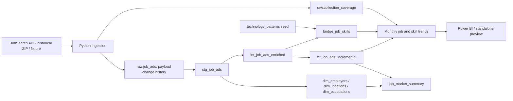

# Swedish Job Market Analytics — dbt Data Pipeline

A job-market analytics pipeline transforming Arbetsförmedlingen advertisements into dimensional models for analysing roles, employers, geography and technology mentions. Python handles API ingestion; dbt Core handles SQL transformations, tests, documentation and lineage. Data is stored locally in DuckDB.

**Stack:** dbt Core · SQL · DuckDB · Python · REST API · Git

## Historical analysis: 2024–2025

The historical pipeline reads both official annual archives, retains the defined role cohort, builds monthly job/skill trends, checks coverage and exports an editable Power BI project with a standalone chart preview.

```powershell
python -m venv .venv
.\.venv\Scripts\Activate.ps1
python -m pip install -r requirements.txt
python scripts/run_history_pipeline.py
```

The first run downloads approximately 1.7 GB into `data/history_archives/`. Subsequent runs reuse those ZIP files. To rebuild models and reporting from the already imported data, use `python scripts/run_history_pipeline.py --skip-import`.

Open `powerbi/JobMarket.pbip` in Power BI Desktop and refresh. For an immediately viewable rendering of the same aggregates, open `reports/generated/trends.html`. See [Power BI instructions](powerbi/README.md), [role inclusion rules](docs/role-scope.md), and [quality review](docs/quality-review.md).

The report shows monthly new-ad counts, technology mention shares and their 2025-versus-2024 change. The role filter distinguishes Data Engineer, Analytics Engineer and Data Scientist. Historical ingestion is separate from live ingestion because the source identifiers and payload formats differ.

## Offline fixture

Python 3.12 is the tested runtime. Run commands from the repository root. On Windows PowerShell:

```powershell
python -m venv .venv
.\.venv\Scripts\Activate.ps1
python -m pip install -r requirements.txt
python scripts/ingest_jobs.py --fixture fixtures/jobs.json
dbt debug --profiles-dir .
dbt build --profiles-dir .
dbt docs generate --profiles-dir .
dbt docs serve --profiles-dir .
```

On macOS/Linux, activate with `source .venv/bin/activate`; the remaining commands are identical. If PowerShell activation is disabled, use `.\.venv\Scripts\python.exe` and `.\.venv\Scripts\dbt.exe` directly. Stop the documentation server with Ctrl+C.

The fixture contains **four invented advertisements**, including a record with missing dimension attributes. It requires no API access. Data is stored in the ignored `data/job_market.duckdb` file. `profiles.yml` contains only local settings and is safe to commit.

Runtime: dbt Core 1.12.4, dbt-duckdb 1.11.0 and DuckDB 1.5.5, on Python 3.12. Python regression tests cover archive replay/failure handling, incremental/full-refresh equivalence, taxonomy shape differences, missing months, zero denominators and year-over-year calculations. Direct dependencies are pinned; transitive dependencies are resolved by pip. The GitHub Actions workflow is supplied but has not yet been run on GitHub.

## Architecture and model structure



| Layer | Responsibility |
| --- | --- |
| `scripts/ingest_jobs.py` | Fetch bounded, paginated searches; retry transient errors; validate IDs; append changed JSON payloads transactionally |
| `scripts/ingest_history.py` | Stream annual ZIP/JSONL archives, retain role candidates, fingerprint files and record monthly completion |
| `models/staging/` | `source()` access, latest version per ID, string normalization, date casts, source identifiers, dimension keys |
| `models/intermediate/` | `ref()` to staging; explainable role and seniority rules |
| `models/marts/` | Incremental ad fact, three dimensions, job/skill bridge, monthly regional summary |
| `seeds/` | Reviewable technology regex dictionary |
| `tests/` | Cross-model reconciliation and bridge grain SQL assertions |
| `analyses/` | Example employer and skill queries compiled by dbt |
| `python_tests/` | Ingestion regression and full pipeline integration checks |
| `powerbi/` | Editable PBIP report and local CSV import semantic model |

dbt's default schema naming produces `analytics_staging`, `analytics_intermediate`, and `analytics_marts`. The seed lives in `analytics`; ingestion alone writes `raw`.

The 13 SQL models use two staging models (ads and coverage), two intermediate models (classification and calendar), and nine marts. Dimension-specific deduplication lives in the dimensions; there are no separate staging tables for entities absent from the source. Flat directories remain sufficient. See [architecture and data coverage](docs/architecture-and-data-coverage.md) for design decisions and source limits.

## Data source and live ingestion

The public [JobTech JobSearch API](https://jobsearch.api.jobtechdev.se/) exposes searchable advertisements. Its [official getting-started guide](https://gitlab.com/arbetsformedlingen/job-ads/jobsearch-apis/-/blob/main/docs/GettingStartedJobSearchEN.md) describes free-text queries and pagination with a maximum page size of 100. This project uses the Core [dbt-duckdb adapter](https://github.com/duckdb/dbt-duckdb).

Keep live data in a separate database. In PowerShell:

```powershell
$env:JOB_MARKET_DB = 'data/live_jobs.duckdb'
python scripts/ingest_jobs.py --query 'data engineer' --query 'analytics engineer' --query 'data scientist' --max-pages 3
dbt build --profiles-dir .
dbt docs generate --profiles-dir .
```

On macOS/Linux use `export JOB_MARKET_DB=data/live_jobs.duckdb`. The environment variable controls both Python and dbt. Python's optional `--database` flag only affects ingestion, so prefer the shared variable for a pipeline run. To return to the fixture database, run `Remove-Item Env:JOB_MARKET_DB` (PowerShell) or `unset JOB_MARKET_DB` (shell).

Queries overlap: ingestion deduplicates IDs within a batch and skips payloads identical to the latest stored version. All pages are fetched before the write transaction. HTTP failures abort the run; page caps produce a warning. Requests have a timeout and retry backoff. Pagination over a changing live index is best effort; no completeness guarantee is implied.

Raw payloads preserve fields for later exploration, including descriptions and structured `must_have.skills`. Historical taxonomy arrays are normalized in dbt, preferring entries marked `original_value` and otherwise the first entry; API taxonomy objects are supported too. Raw data, database files, logs and generated docs are ignored by Git. Only synthetic source examples are intended for version control.

## Dimensional model

`fct_job_ads` has **one row per observed advertisement ID**, representing its latest observed state. Counts measure ads, not positions. It holds three dimension foreign keys, source dates, title, employment type, role family, seniority and ingestion metadata.

- `dim_employers`: organization number where present; otherwise normalized employer name or an unknown key. Type 1 attributes reflect the latest observed record. Name fallback can conflate employers and is deliberately documented.
- `dim_locations`: a deterministic key from country, municipality code/name and region. Missing labels become `Unknown`; country prevents foreign locations being treated as Swedish ones.
- `dim_occupations`: source concept ID with label fallback; latest observed label, Type 1.
- `bridge_job_skills`: one row per ad/technology pair. Use this for skill counts without multiplying fact rows. For ratios, divide distinct matching ad IDs by the eligible fact population, not by total bridge rows.

Keys are deterministic hashes of source values. Source identifiers remain in dimensions. Unknown members maintain relationships without inventing source identifiers. No slowly changing dimension history is claimed.

## Incremental processing

Each changed payload receives a monotonically increasing `ingestion_id`. Staging selects the latest ID per job. The fact's `is_incremental()` filter selects rows above the fact watermark, and `delete+insert` replaces matching `job_id` values. An updated ad with an old publication date is processed correctly. Unchanged ingestion replays add no raw rows; A → B → A payload changes are retained. Gaps in sequence values are harmless.

```powershell
python scripts/ingest_jobs.py --fixture fixtures/jobs.json
dbt build --profiles-dir .
# Rebuild transformations after changing classification rules or key logic:
dbt build --full-refresh --profiles-dir .
```

Dimensions and the skill bridge rebuild fully. Staging scans raw history; the incremental fact filter reduces writes but does not eliminate upstream scans. Keep ingestion and dbt runs sequential; DuckDB is used by one writer at a time. Never reset raw history independently of the fact watermark; rebuild marts if the raw store is replaced.

An ad missing from a later search is **not** treated as deleted. Search disappearance can mean expiry, changed ranking or changed query relevance. The fact therefore represents collected ads, not currently active inventory. Change capture covers updates seen by subsequent searches, not every upstream update. A production extension would use a source change feed and explicit deletion events.

## Testing, documentation and lineage

`dbt build` runs seeds, models and data tests in dependency order. YAML tests cover `not_null`, `unique`, `relationships`, and `accepted_values`. Custom SQL checks reconcile fact IDs and versions against staging and enforce bridge grain. Required title/publication fields fail visibly if missing or unparseable; optional malformed dates safely become NULL. Source timestamps retain their supplied wall time; ingestion timestamps are timezone-aware.

```powershell
python -m pytest python_tests -q
dbt docs generate --profiles-dir .
dbt docs serve --profiles-dir .
```

The integration test uses an isolated temporary database, builds the complete graph, verifies an unchanged rerun, adds a new ad with an older publication date, updates an existing ad and employer, then compares incremental fact output with a full refresh. GitHub Actions runs the tests, a fixture build and docs generation on pushes and pull requests. Browse model descriptions and the dependency graph in dbt docs; generated `manifest.json` and `catalog.json` are in `target/`.

Historical runs store dbt artifacts in `target/history/`. Serve them with `dbt docs serve --profiles-dir . --target-path target/history`. The monthly trend grid includes every role/skill/month combination. A completed month with no ads has a zero count and a NULL share; an incomplete month has NULL analytical totals. The export fails if coverage is incomplete or the candidate-rule fingerprint changed. Annual comparisons require 12 complete months per year.

## Analytics and interpretation

Query the database with any DuckDB SQL client, or use Python:

```powershell
python -c "import duckdb; c=duckdb.connect('data/job_market.duckdb', read_only=True); print(c.execute('select * from analytics_marts.job_market_summary order by publication_month, role_family').fetchall())"
```

Examples (change the file path above to inspect live data):

```sql
-- Ads by publication month, region and role in the collected sample
select * from analytics_marts.job_market_summary;

-- Frequently mentioned technologies
select skill, count(*) as ads_mentioning_skill
from analytics_marts.bridge_job_skills
group by skill order by ads_mentioning_skill desc, skill;

-- Regional and municipal distribution
select l.region, l.municipality, count(*) as ads
from analytics_marts.fct_job_ads f
join analytics_marts.dim_locations l using (location_id)
group by 1, 2 order by ads desc;
```

Expected **fixture results**: SQL appears in 4/4 ads; Python and dbt each appear in 2/4. Stockholm has two ads. One title is junior, one senior, and two unspecified. These validate the transformations; they are not Swedish labour-market findings.

Free-text search is a convenience sample: role mentions in descriptions can retrieve unrelated titles. Historical selection uses the versioned title/taxonomy rules in `seeds/role_patterns.csv`, with management exclusions and ambiguous-match flags. Seniority is a title heuristic, with unspecified distinct from mid-level. Skill regexes detect mentions, including optional or negated mentions, and do not prove requirements. Fabric requires Microsoft/MS context to reduce false matches.

Publication-month counts describe cohorts of collected ads. A current search cannot establish historical demand trends because expired ads are absent and long-running ads are overrepresented. The historical pipeline instead uses the two annual files and publication dates, retaining cross-year spillover candidates. Full file processing establishes coverage of those archive releases, not a guarantee of all Swedish vacancies. Nine predefined technologies are tracked; automatic discovery of new technology names and requirement/merit classification are not implemented.

## Git workflow

Review `git status` and `git diff` before staging. `.gitignore` excludes environments, databases, raw data, dbt artifacts, credentials and secrets. Keep changes focused (ingestion, modelling, tests, docs). No remote publishing is required to run locally; create a GitHub repository and push only after reviewing the files.
